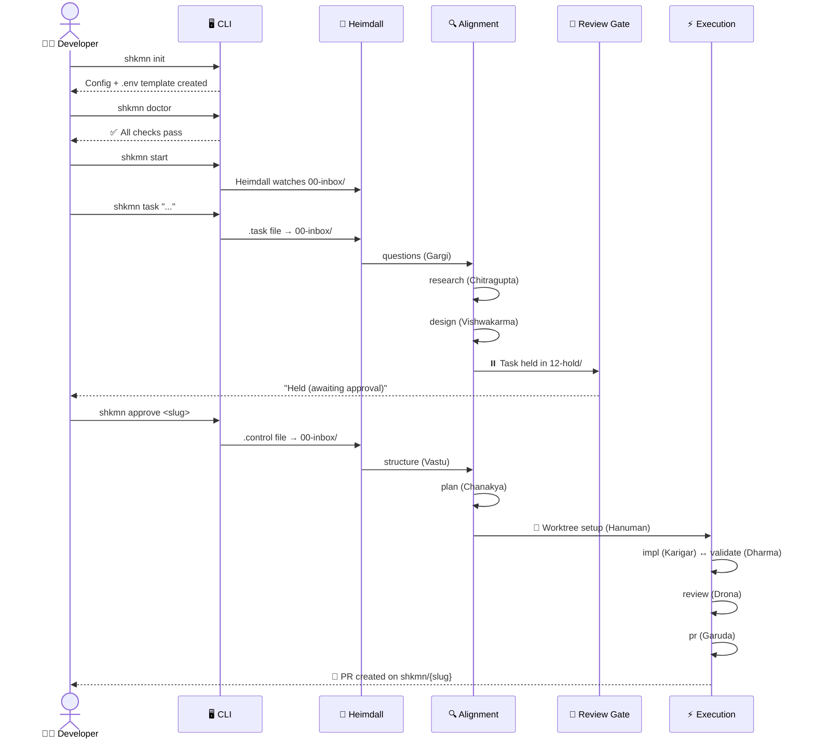

# 🚀 ShaktimaanAI Quickstart

> Get your first AI-driven PR in ~10 minutes.

ShaktimaanAI automates the full development lifecycle — from task intake through research, design, implementation, testing, review, and PR creation. This guide walks you through setup and your first task.

---

## 📋 Prerequisites

Before you begin, make sure the following tools are installed and configured:

| Tool | Version | Check | Auth |
|------|---------|-------|------|
| **Node.js** | 20+ | `node --version` | — |
| **Git** | any | `git --version` | — |
| **Claude Code CLI** | latest | `claude --version` | `claude login` **or** set `ANTHROPIC_API_KEY` in `.env` |
| **GitHub CLI** | any | `gh --version` | `gh auth login` (required) |
| **Azure CLI** *(optional — only for Azure DevOps integration)* | any | `az --version` | `az login` |

> **Note:** The pipeline uses the Claude Agent SDK, which spawns Claude Code as a subprocess. Claude Code must be installed and authenticated before `shkmn start` will work.

---

## 📦 Clone & Install

```bash
git clone https://github.com/prpande/ShaktimaanAI.git
cd ShaktimaanAI
npm install
npm run build
npm link
```

> `npm run build` compiles TypeScript to `dist/` and copies agent prompts. It **must** run before `npm link`, which registers the `shkmn` CLI globally.

After linking, verify the CLI is available:

```bash
shkmn --version
```

---

## 🪔 First-Time Setup (`shkmn init`)

Run the interactive setup wizard:

```bash
shkmn init
```

The wizard prompts for 7 values. Only the first is required — press Enter to skip the rest:

| # | Prompt | Required? | Default / Notes |
|---|--------|-----------|-----------------|
| 1 | `runtimeDir` | ✅ **Yes** | `~/.shkmn/runtime` — where task files, logs, and config live |
| 2 | `reposRoot` | ⬜ No | Parent folder for git repos. Press Enter to skip. |
| 3 | `adoOrg` | ⬜ No | Azure DevOps organization. Press Enter to skip. |
| 4 | `adoProject` | ⬜ No | Azure DevOps project. Press Enter to skip. |
| 5 | `adoArea` | ⬜ No | Azure DevOps area path. Press Enter to skip. |
| 6 | `dashboardRepoUrl` | ⬜ No | Dashboard git remote URL. Press Enter to skip. |
| 7 | `dashboardRepoLocal` | ⬜ No | Local dashboard repo path. Press Enter to skip. |

### 🔑 Set your API key

After init completes, open the generated `.env` file and add your Anthropic API key:

```bash
# Open the .env file in your runtime directory:
# (default location shown — adjust if you chose a different runtimeDir)
notepad ~/.shkmn/runtime/.env      # Windows
# or: code ~/.shkmn/runtime/.env   # VS Code
```

Set `ANTHROPIC_API_KEY` to your key (get one at [console.anthropic.com](https://console.anthropic.com)):

```
ANTHROPIC_API_KEY=sk-ant-...
```

> **💡 Tip:** If you've already authenticated Claude Code via `claude login`, the pipeline can use that session instead. But the `.env` key is the most reliable path.

---

## 🩺 Verify Setup (`shkmn doctor`)

Before starting the pipeline, run the health check:

```bash
shkmn doctor
```

`shkmn doctor` validates:
- ✅ Required tools are installed (Node.js, Git, Claude Code, GitHub CLI)
- ✅ Config file exists and is valid
- ✅ Environment variables are present in `.env`
- ✅ GitHub CLI is authenticated (`gh auth status`)

Fix any reported issues before proceeding.

> **⚠️ Important:** `shkmn start` does **not** validate environment values — it will start silently even with empty keys. Always run `shkmn doctor` first to catch missing configuration.

---

## ▶️ Start the Pipeline

Open a **dedicated terminal** and run:

```bash
shkmn start
```

The Heimdall watcher starts in the foreground, monitoring `00-inbox/` for new tasks and control files.

> **⚠️ Warning:** Run `shkmn start` in **only one terminal**. Running it twice causes race conditions — there is no duplicate-instance guard. If you accidentally start a second instance, stop both and restart with a single `shkmn start`.

Leave this terminal running. Use a second terminal for the commands below.

---

## 📝 Submit Your First Task

In a separate terminal:

```bash
shkmn task "Add a health-check endpoint to the API that returns { status: 'ok' }"
```

What happens:
1. A **slug** is printed (e.g., `add-a-health-check-endpoint-20260406104223`) — save this for later commands.
2. A `.task` file is written to `00-inbox/`.
3. The Heimdall watcher (from `shkmn start`) picks it up and begins the pipeline: **questions → research → design** (then pauses for approval).

**Useful flags:**

| Flag | Purpose |
|------|---------|
| `--quick` | ⚡ Skip the full pipeline — Astra triages and executes directly |
| `--repo <path>` | 📂 Target a specific repository instead of the configured default |
| `--stages <list>` | 🔧 Comma-separated custom stage list |
| `--hints <text>` | 💡 Extra context for the agents |

> **📌 Note:** `shkmn task` works independently of `shkmn start` — you can submit tasks before the watcher is running. The task file sits in `00-inbox/` and gets processed when the watcher starts (or restarts).

---

## 📊 Monitor Progress

### Check task status

```bash
shkmn status
```

Shows all active and held tasks with their current stage and elapsed time. The slug for each task is displayed in the output — use it with `shkmn logs` and `shkmn approve`.

### Tail live logs

```bash
shkmn logs <slug> -f
```

Streams agent output in real time. Supports **prefix matching** — you don't need the full slug:

```bash
shkmn logs add-a-he -f
```

**🔎 Slug discovery:** The slug is printed by `shkmn task` when you create it, and is visible in `shkmn status` output.

---

## ✅ Approve the Design Gate

After the **design** stage completes, the pipeline pauses. Your task moves to `12-hold/` and `shkmn status` shows it as **"Held (awaiting approval)"**.

This is your chance to review the design before implementation begins.

**1. Review the design output in the logs:**

```bash
shkmn logs <slug>
```

**2. Approve and resume the pipeline:**

```bash
shkmn approve <slug>
```

The pipeline resumes through the remaining stages: **structure → plan → impl → validate → review → pr**.

**💬 Conditional approval:** Use `--feedback` to approve with notes for the agents:

```bash
shkmn approve <slug> --feedback "Use PostgreSQL instead of SQLite for the database layer"
```

> **📌 Reminder:** `shkmn start` must be running for approval to take effect — the watcher picks up the `.control` file from `00-inbox/` and resumes the pipeline.

---

## 🎉 Find Your PR

When the **pr** stage completes, Garuda automatically creates a pull request on a `shkmn/{slug}` branch via `gh pr create`.

**Where to find it:**

- **📜 In the logs** — the PR URL is printed as the final output of the pr stage
- **🌐 On GitHub** — check the repository's pull request tab
- **💻 Via CLI:**

```bash
gh pr list
```

---

## 🗺️ Pipeline Flow Overview



---

## 🔧 Troubleshooting

### 🪟 EBUSY errors on Windows

**Symptom:** You see `EBUSY: resource busy or locked` errors in the logs during stage transitions.

**Cause:** Windows holds file handles longer than Linux/macOS. When the pipeline moves a task directory between stages (e.g., `01-questions/pending` → `01-questions/done`), open file handles can block the rename.

**Built-in mitigation:** The pipeline automatically retries up to **5 attempts with exponential backoff** (100ms → 200ms → 400ms → 800ms → 1600ms), then falls back to a **copy + delete fallback** strategy.

**If errors persist:**
1. Close editors, terminals, or file explorers that have files open inside the runtime directory
2. Stop and restart `shkmn start`

### ⏰ Agent timeout

Each pipeline stage has a default timeout:

| Stage | Timeout | Model |
|-------|---------|-------|
| questions | 15m | sonnet |
| research | 45m | sonnet |
| design | 30m | opus |
| structure | 20m | sonnet |
| plan | 30m | opus |
| impl | 90m | opus |
| validate | 30m | haiku |
| review | 45m | sonnet |
| pr | 15m | sonnet |

**What happens:** When a stage times out, the agent is aborted and the task moves to `11-failed/`.

**Recovery:**
1. Check the logs: `shkmn logs <slug>`
2. If transient (network, API rate limit), use `shkmn retry <slug>` or re-submit with `shkmn task`
3. If held in `12-hold/` (design gate), use `shkmn retry <slug> --feedback "..."`

### 🩺 Recovery agent diagnosis

When a task fails, **Chiranjeevi** (the recovery agent) automatically diagnoses the failure. Use `shkmn recover` to see:
- 📋 Diagnosis summary
- 🔄 Recommended re-entry stage
- 🐛 GitHub issue link (if filed)

```bash
shkmn recover     # list all recovery-held tasks
```

### 🔄 Recovery after crash

If `shkmn start` crashes or you close the terminal accidentally:

```bash
shkmn start
```

Just run `shkmn start` again. The recovery system automatically:
- 🔄 Scans all pipeline directories (`pending/`, `done/`, `00-inbox/`, `12-hold/`)
- ▶️ Resumes in-progress tasks from where they left off
- 🩺 Offers recovery re-entry for diagnosed failures in `12-hold/`
- 📥 Processes unhandled `.task` files from the inbox

**Edge case:** If `run-state.json` inside a task directory is corrupted (e.g., due to a hard crash mid-write), the recovery system logs an error but continues with other tasks. To fix: delete the affected task directory from the runtime folder and re-submit the task.

> **📌 Note:** Recovery has a 2-hour timeout per task. If a task was mid-execution in a very long stage when the crash happened, recovery may time out — in that case, re-submit with `shkmn task`.

---

## 📋 Quick Reference

| Command | Description | Key Flags |
|---------|-------------|-----------|
| `shkmn init` | 🪔 Interactive setup wizard | — |
| `shkmn doctor` | 🩺 System health check | `--fix` to auto-repair |
| `shkmn start` | ▶️ Start Heimdall watcher (foreground, one instance only) | — |
| `shkmn task` | 📝 Submit a new task | `--quick`, `--repo`, `--stages`, `--hints` |
| `shkmn status` | 📊 Show active and held tasks | — |
| `shkmn logs` | 📜 View or tail agent logs | `<slug> -f`, `--lines <n>` |
| `shkmn approve` | ✅ Approve a held task | `<slug>`, `--feedback "..."` |
| `shkmn recover` | 🩺 List and re-enter recovery-held tasks | — |
| `shkmn stop` | ⏹️ Gracefully stop the watcher | — |
| `shkmn service` | 🔧 Manage watchdog systemd service | `install`, `uninstall`, `status`, `logs` |
| `shkmn stats` | 📈 Daily/session pipeline statistics | — |

---

## 🔧 Watchdog Service

For always-on operation without keeping a terminal open, install ShaktimaanAI as a systemd service:

```bash
shkmn service install    # install and start the watchdog
shkmn service status     # check if running
shkmn service logs       # view watchdog output
```

See [README.md — Watchdog Service](README.md#-watchdog-service) for configuration details.

---

## 🗺️ What's Next

- **[README.md](README.md)** — Architecture overview, agent descriptions, full CLI reference, token budgets, and model assignments
- **`shkmn doctor --fix`** — Run periodically to catch configuration drift and auto-repair common issues
- **Explore the agents** — See `agents/` for the prompt templates that drive each pipeline stage
- **`shkmn recover`** — Check for failed tasks that Chiranjeevi has diagnosed and can be re-entered
