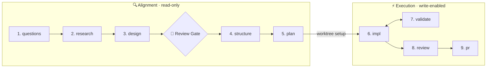
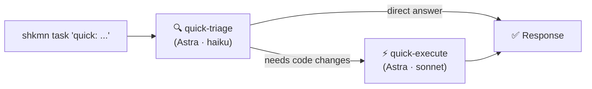
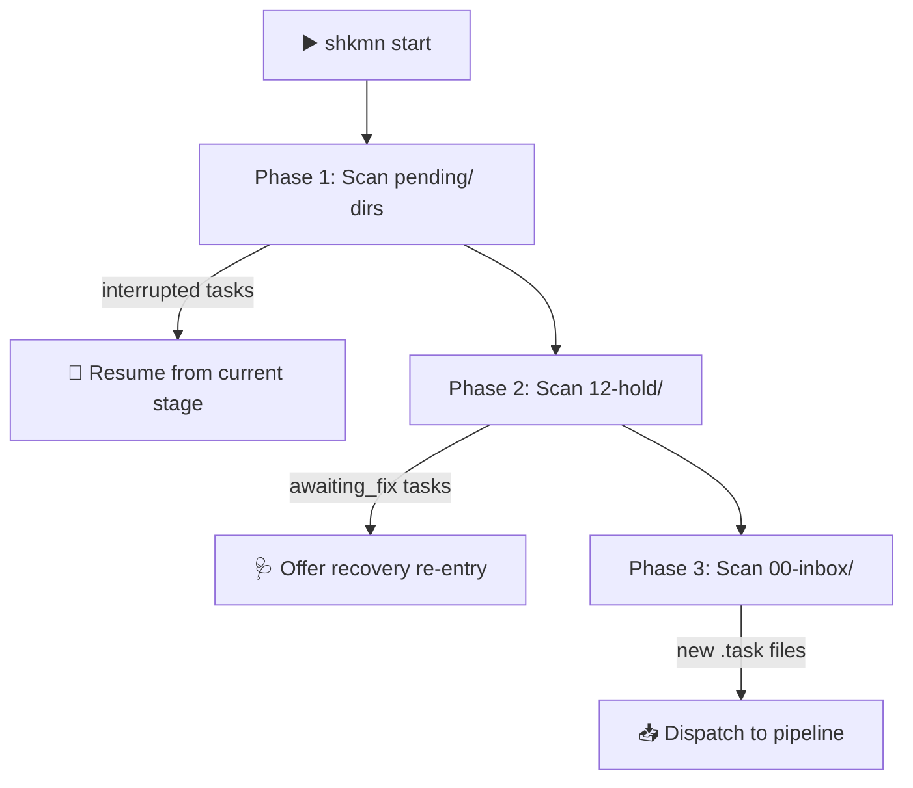
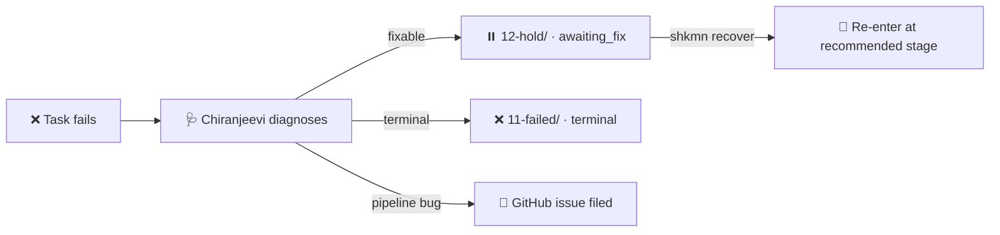

<!-- Last verified: 2026-04-10 | Sources of truth: src/cli.ts (commands), src/config/defaults.ts (agent names, config, budgets) -->

<p align="center">
  
</p>

# 🛕 ShaktimaanAI

An agentic development pipeline that automates the software development lifecycle — from task intake through research, design, implementation, testing, review, and PR creation.

ShaktimaanAI uses [Claude's Agent SDK](https://github.com/anthropics/claude-agent-sdk) to run specialized LLM-powered agents through a 9-stage pipeline, orchestrated by deterministic TypeScript code. Drop a task in via the CLI (`shkmn task "..."`) and the pipeline handles the rest.

## 🏗️ Pipeline Architecture

Tasks flow through 9 stages split into two phases:



**🔍 Alignment stages** (questions → plan) explore the problem space without modifying code. Agents in these stages have Read/Glob/Grep access but cannot Write or Edit files.

**⚡ Execution stages** (impl → pr) modify code. The `impl` stage is the first with Write/Edit tool permissions.

### 🛑 Review Gate

After the **design** stage, tasks pause automatically and move to the `12-hold/` directory. A human reviews the design and resumes the pipeline with:

```bash
shkmn approve <task-slug>
```

This is configured via `agents.defaultReviewAfter` (default: `"design"`).

### 🌳 Worktree Isolation

Before the `impl` stage, the pipeline engine creates an isolated git worktree at `shkmn/<task-slug>`. Each task gets its own branch, preventing concurrent tasks from interfering with each other. This is an infrastructure step performed by the pipeline engine — not a pipeline stage.

## 🤖 Agents

Each agent is named after figures from Hindu mythology and Hindi culture, reflecting its role.

### Pipeline Stage Agents

| # | Stage | Agent | Role | Named After |
|---|---|---|---|---|
| 1 | questions | **Gargi** | Generates targeted technical questions to clarify the task | The fearless scholar who challenged sages |
| 2 | research | **Chitragupta** | Researches the codebase and gathers facts objectively | Divine scribe who records all deeds |
| 3 | design | **Vishwakarma** | Designs the technical architecture and approach | Architect of the gods |
| 4 | structure | **Vastu** | Decomposes the design into vertical implementation slices | Science of structure and layout |
| 5 | plan | **Chanakya** | Writes a tactical, step-by-step implementation plan | Master strategist and advisor |
| 6 | impl | **Karigar** | Writes code following TDD (tests first, then implementation) | Craftsman / artisan |
| 7 | validate | **Dharma** | Validates that builds pass and tests are green | Impartial judge of right action |
| 8 | review | **Drona** | Reviews code quality and suggests improvements | Strict guru and teacher |
| 9 | pr | **Garuda** | Creates the pull request and pushes the branch | Swift divine messenger |

### Infrastructure Agents

| Component | Agent | Role |
|---|---|---|
| 🔭 Watcher | **Heimdall** | Watches `00-inbox/` for new `.task` and `.control` files, dispatches to pipeline |
| 🪔 Task Creator | **Brahma** | Builds canonical `.task` files with metadata from CLI or other surfaces |
| ⚡ Approval Handler | **Indra** | Finds held tasks in `12-hold/` and resumes pipeline on approval |
| 🩺 Recovery | **Chiranjeevi** | Diagnoses failed tasks — determines if fixable or terminal, recommends re-entry stage, optionally files GitHub issues |
| 🌳 Worktree | **Hanuman** | Named role for git worktree operations — infrastructure utility, not a pipeline stage |

### Quick Task Agents

| Variant | Agent / Stage | Role |
|---|---|---|
| 🔍 Triage | **Astra** (`quick-triage`) | Read-only classification — routes quick tasks (haiku, 2 min timeout) |
| ⚡ Execute | **Astra** (`quick-execute`) | Write-enabled execution for quick tasks (sonnet, 30 min timeout) |
| 📦 Legacy | **Astra** (`quick`) | Single-shot quick tasks (haiku, 2 min timeout) |

### Slack Integration

| Component | Agent | Role |
|---|---|---|
| 💬 Slack I/O | **Narada** | Routes and responds to Slack messages using MCP Slack tools |

## ✨ Key Features

- **🔍 QRSPI alignment stages** — five read-only stages (questions, research, design, structure, plan) prevent the "plan-reading illusion" where plans look good but rest on wrong technical assumptions
- **🧪 TDD execution** — the impl/validate loop follows red-green-refactor: Karigar writes tests first, then implementation; Dharma validates builds and test results
- **⚙️ Deterministic orchestration** — routing, state transitions, and recovery are pure TypeScript. LLMs are used only within agent stages and for intent classification
- **🛑 Review gates** — tasks pause after configurable stages (default: design) for human review before execution begins
- **🌳 Worktree isolation** — each task runs in its own git worktree and branch, enabling concurrent task execution without interference
- **🔄 Crash recovery** — folder-based state means the pipeline can be killed at any time. On restart, `shkmn start` scans pending directories and resumes interrupted tasks automatically
- **🩺 Recovery agent** — when tasks fail, Chiranjeevi diagnoses the root cause, recommends a re-entry stage, and optionally files GitHub issues for pipeline-level bugs
- **💰 Token budgeting** — per-model weekly/daily/session/task token limits with peak-hours throttling and safety margins
- **💬 Slack integration** — Narada routes Slack messages, and the research stage can query Slack channels and Notion databases for context

## ⚡ Quick Tasks

For simple, single-step tasks that don't need the full 9-stage pipeline, prefix your task with `quick:`:

```bash
shkmn task "quick: fix the typo in the footer component"
```

Quick tasks use a two-phase flow:



1. **quick-triage** — Astra (haiku) reads the codebase and classifies the request. If it can answer directly, it does. If code changes are needed, it routes to quick-execute.
2. **quick-execute** — Astra (sonnet) executes the task with full Write/Edit/Bash permissions and a 30-minute timeout.

Both variants have access to Notion and Slack (read-only) MCP tools.

## 📋 Prerequisites

| Tool | Check Command | Required |
|---|---|---|
| Node.js ≥ 20 | `node --version` | ✅ Yes |
| Claude Code | `claude --version` | ✅ Yes |
| GitHub CLI | `gh --version` | ✅ Yes |
| Git | `git --version` | ✅ Yes |
| Azure CLI | `az --version` | ⬜ Optional |

Run `shkmn doctor` after installation to verify all prerequisites and configuration.

## 📦 Installation

```bash
git clone https://github.com/prpande/ShaktimaanAI.git
cd ShaktimaanAI
npm install
npm run build
npm link
```

After linking, the `shkmn` command is available globally on your machine.

### 🔑 Environment Variables

Copy the example environment file and fill in your keys:

```bash
cp .env.example .env
```

| Variable | Required | Description |
|---|---|---|
| `ANTHROPIC_API_KEY` | **Yes** | API key for Claude Agent SDK — agents cannot run without this |
| `GITHUB_PAT` | ⬜ Optional | GitHub personal access token for PR creation |
| `ADO_PAT` | ⬜ Optional | Azure DevOps personal access token |
| `SLACK_TOKEN` | ⬜ Optional | Slack bot token for Slack integration |
| `SLACK_WEBHOOK_URL` | ⬜ Optional | Slack webhook for notifications |

Place the `.env` file in your ShaktimaanAI runtime directory (the directory you select during `shkmn init`).

## ⚙️ Configuration

Run the setup wizard to create your configuration file:

```bash
shkmn init
```

This creates `shkmn.config.json` with your runtime directory, repository paths, and agent settings.

### Reading and Writing Config

```bash
shkmn config get agents.defaultReviewAfter    # → "design"
shkmn config set agents.retryCount 2
```

### Key Config Sections

| Section | Purpose |
|---|---|
| `pipeline` | Runtime directory and agent prompt paths |
| `repos` | Repository root and aliases for multi-repo setups |
| `agents` | Stage list, review gates, concurrency limits, timeouts, tool permissions, per-stage model assignments |
| `worktree` | Retention period (`retentionDays: 7`) and cleanup behavior |
| `quickTask` | Review requirements for quick tasks |
| `slack` | Slack integration — channel, polling intervals, notify level, DM config, outbound prefix |
| `ado` | Azure DevOps organization, project, and area path |
| `schedule` | Rollup time, Notion push schedule, monthly report schedule |
| `recovery` | Recovery agent toggle, GitHub issue filing, target repo |
| `review` | Code review behavior (`enforceSuggestions`) |
| `service` | Watchdog service mode, repo path, check interval |

### 🧠 Per-Stage Model Assignments

Each stage uses a specific Claude model, balancing quality vs. cost:

| Model | Stages |
|---|---|
| **opus** 🔮 | design, plan, impl, recovery |
| **sonnet** 🎯 | questions, research, structure, review, pr, quick-execute |
| **haiku** ⚡ | validate, quick-triage, quick (legacy), slack-io |

Override per-stage: `shkmn config set agents.models.impl sonnet`

### 💰 Token Budgets

The pipeline enforces per-model token budgets to control costs:

| Model | Weekly | Daily | Session | Per-Task |
|---|---|---|---|---|
| **sonnet** | 15M | 3M | 800K | 200K |
| **opus** | 5M | 1M | 300K | 100K |
| **haiku** | 30M | 6M | 1.5M | 400K |

- **⏰ Peak-hours throttling:** 0.5× multiplier during 12:00–18:00 UTC
- **🛡️ Safety margin:** 15% reserved across all limits

## 🖥️ CLI Commands

### Setup

| Command | Description |
|---|---|
| `shkmn init` | 🪔 Interactive setup wizard — creates config, runtime dirs |
| `shkmn config get <path>` | 📖 Get a config value by dot-path |
| `shkmn config set <path> <value>` | ✏️ Set a config value by dot-path |
| `shkmn doctor` | 🩺 System health check — verifies prerequisites, config, env, agent prompts |

### Lifecycle

| Command | Description |
|---|---|
| `shkmn start` | ▶️ Start the watcher daemon (Heimdall) and resume interrupted tasks |
| `shkmn stop` | ⏹️ Stop the watcher daemon gracefully |

### Task Management

| Command | Description |
|---|---|
| `shkmn task "<description>"` | 📝 Create a new task and drop it in the inbox |
| `shkmn approve [slug]` | ✅ Approve a task paused at a review gate |
| `shkmn cancel [slug]` | ❌ Cancel a running or pending task |
| `shkmn skip [slug]` | ⏭️ Skip the current stage and advance to the next |

### Pipeline Control

| Command | Description |
|---|---|
| `shkmn pause [slug]` | ⏸️ Pause a running task |
| `shkmn resume [slug]` | ▶️ Resume a paused task |
| `shkmn modify-stages [slug]` | 🔧 Change the remaining stages for a task |
| `shkmn restart-stage [slug]` | 🔄 Re-run the current stage from scratch |
| `shkmn retry [slug]` | 🔁 Retry a failed task from its last stage |

### Recovery & Service

| Command | Description |
|---|---|
| `shkmn recover` | 🩺 List held recovery tasks (diagnosed by Chiranjeevi) and re-enter them |
| `shkmn service install` | 📦 Install the ShaktimaanAI watchdog as a systemd service |
| `shkmn service uninstall` | 🗑️ Remove the watchdog service |
| `shkmn service status` | 📊 Check watchdog service status |
| `shkmn service logs` | 📜 View watchdog service logs |

### Diagnostics

| Command | Description |
|---|---|
| `shkmn status` | 📊 Show active pipeline runs and their current stage |
| `shkmn logs [slug]` | 📜 Tail logs for a specific task |
| `shkmn history` | 📋 Show recently completed tasks |
| `shkmn stats` | 📈 Display daily/session pipeline statistics |

## 📖 Usage Examples

### Initial Setup

```bash
shkmn init       # interactive wizard — sets runtime dir, repo paths
shkmn doctor     # verify prerequisites and configuration
```

### Running a Task

```bash
shkmn start                          # start the watcher daemon
shkmn task "Add user authentication" # create a task
shkmn status                         # check pipeline progress
```

### Reviewing and Approving

```bash
# After the design stage, the task pauses at 12-hold/
shkmn status                         # shows task waiting for approval
shkmn approve add-user-auth          # approve and resume pipeline
```

### Checking Logs and History

```bash
shkmn logs add-user-auth             # tail logs for a specific task
shkmn history                        # show recently completed tasks
shkmn stats                          # daily pipeline statistics
```

### Quick Task

```bash
shkmn task "quick: fix the broken link in the footer"
# Astra handles it — triage → execute if needed
```

### Recovery

```bash
shkmn recover                        # list tasks diagnosed by Chiranjeevi
# Shows diagnosis, recommended re-entry stage, and GitHub issue link (if filed)
```

## 🔄 Recovery & Crash Resilience

ShaktimaanAI uses a **folder-based state machine**. Task state is determined by which directory the task file lives in:

| Directory | State |
|---|---|
| `00-inbox/` | 📥 New task, awaiting pickup |
| `01-questions/` through `09-pr/` | ⚙️ Active in the named stage (with `pending/` and `done/` subdirectories) |
| `10-complete/` | ✅ Successfully finished |
| `11-failed/` | ❌ Failed after retries exhausted |
| `12-hold/` | ⏸️ Paused at a review gate or awaiting recovery fix |

### Automatic Resume

When `shkmn start` is called, the pipeline performs a 3-phase startup scan:



1. **Phase 1** — Tasks in `pending/` subdirectories are resumed from their current stage
2. **Phase 2** — Tasks in `12-hold/` with `holdReason: "awaiting_fix"` are offered for recovery re-entry
3. **Phase 3** — Tasks in `00-inbox/` are dispatched normally

### 🩺 Recovery Agent (Chiranjeevi)

When a task fails, the pipeline automatically invokes **Chiranjeevi** to diagnose the failure:



- **Fixable failures** (pipeline config issues, prompt bugs) — recommends a re-entry stage and optionally files a GitHub issue
- **Terminal failures** (impossible task, fundamentally wrong approach) — marks the task as terminal with an explanation

Configure recovery behavior:

```bash
shkmn config set recovery.enabled true
shkmn config set recovery.fileGithubIssues true
shkmn config set recovery.githubRepo "owner/repo"
```

### 🌳 Worktree Recovery

If the pipeline crashes mid-implementation, the git worktree at `shkmn/<task-slug>` is preserved. On restart, the existing worktree is **reused** rather than recreated. Completed worktrees are retained for `worktree.retentionDays` (default: 7 days) and cleaned up automatically when `worktree.cleanupOnStartup` is enabled.

## 🔧 Watchdog Service

For always-on operation, install ShaktimaanAI as a systemd service:

```bash
shkmn service install    # install and start the watchdog
shkmn service status     # check if running
shkmn service logs       # view watchdog output
shkmn service uninstall  # remove the service
```

Configure via:

```bash
shkmn config set service.mode "source"           # "source" or "package"
shkmn config set service.checkIntervalMinutes 5
```

## 📚 Documentation

- [System Design Document](docs/superpowers/specs/2026-04-04-shaktimaanai-system-design.md) — full architecture, agent roster, pipeline stages, concurrency model, crash recovery
- [Specs](docs/specs/) — feature specifications organized by lifecycle (`new/`, `pending/`, `done/`)
- [Plans](docs/plans/) — implementation plans organized by lifecycle (`new/`, `pending/`, `done/`)
- [Agent Prompts](agents/) — the `.md` files that define each agent's behavior (authoritative source for agent roles)
- [Production Readiness Audit](docs/production-readiness-audit.md) — audit findings and status
- [0th Draft](docs/0thDraft/) — original brainstorming documents

## 📄 License

MIT — see [LICENSE](LICENSE) for details.
